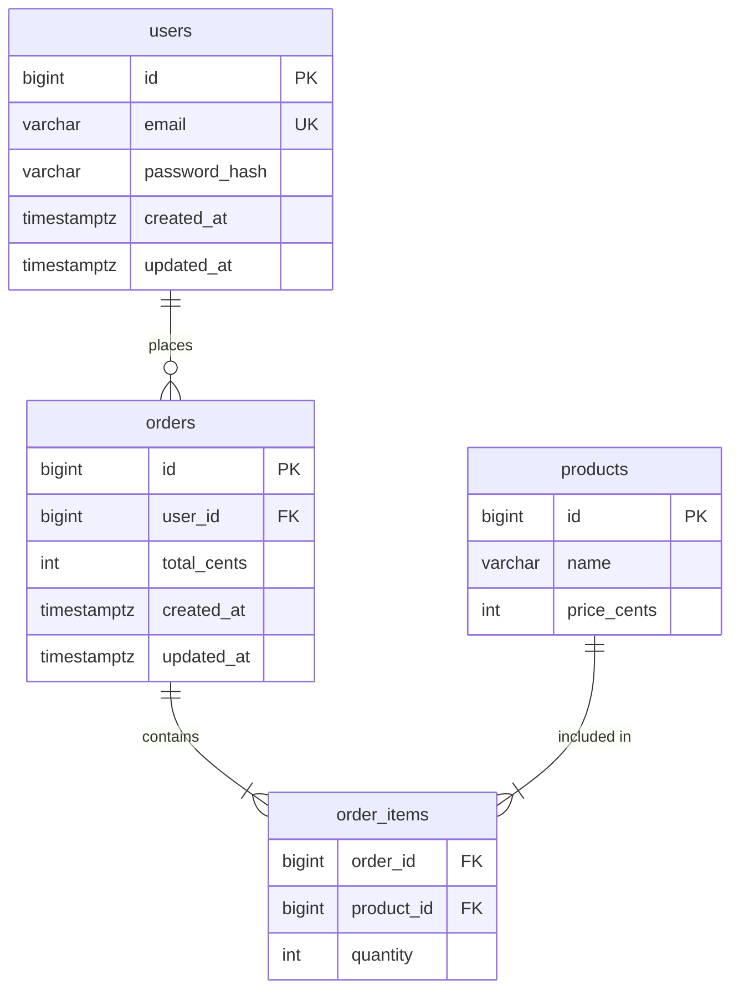

# DB Schema

Design a database schema from requirements: model entities, apply normalization, produce an ER diagram, generate DDL SQL, and write migration files with up/down.

## Purpose

Translate business requirements into a normalized relational database schema with ER diagram, DDL, migration files, and index recommendations.

## Trigger

Apply when user requests:
- "design database", "create schema", "model database", "ER diagram"
- "create table", "add migration", "design tables", "normalize database"
- "設計資料庫", "建立 schema", "建立資料表", "ER 圖", "資料庫建模", "寫 migration"

Do NOT trigger for:
- Querying or analyzing existing data — no schema design needed
- ORM usage or query optimization — not a schema design task
- Performance tuning of existing queries without schema changes

## Prerequisites

- Business requirements or entity descriptions (can be informal)
- Target database engine if known (PostgreSQL / MySQL / SQLite — defaults to PostgreSQL)
- Existing schema files if extending rather than creating from scratch

## Steps

1. **Gather requirements** — extract entities, attributes, and relationships from the user's description; clarify cardinality (one-to-one, one-to-many, many-to-many) and any unclear business rules before proceeding

2. **Identify entities and attributes** — list every entity with its attributes; mark each attribute as: required / optional, unique, PII (Personally Identifiable Information), or sensitive (password, token, card number)

3. **Define relationships** — map every relationship between entities with direction and cardinality; identify junction tables for many-to-many relationships

4. **Apply normalization** — check and enforce up to 3NF:
   - 1NF: eliminate repeating groups; each cell holds one atomic value
   - 2NF: remove partial dependencies — every non-key attribute depends on the full primary key
   - 3NF: remove transitive dependencies — non-key attributes depend only on the primary key
   - Note justified denormalization with explicit reason (e.g. query performance, audit log)

5. **Produce ER diagram** — generate a Mermaid `erDiagram` covering all entities, attributes (with type), and relationships with cardinality labels

6. **Generate DDL SQL** — write `CREATE TABLE` statements for the target engine with: primary keys, foreign keys, unique constraints, check constraints, NOT NULL, default values, and standard audit columns (`created_at`, `updated_at`)

7. **Write migration files** — produce one migration file per logical change with both `up` (apply) and `down` (rollback) sections; name files with a timestamp prefix: `YYYYMMDDHHMMSS_<description>.sql`

8. **Recommend indexes** — propose indexes for: all foreign key columns, frequently filtered columns, unique constraints, and composite indexes for common query patterns; explain each index's purpose

9. **Flag design decisions** — document every non-obvious decision: chosen normalization trade-offs, nullable fields, enum vs lookup table, soft delete strategy, UUID vs auto-increment primary key

10. **Confirm before writing files** — show the full output and wait for user approval; after approval, write DDL and migration files to the paths specified by the user

## Normalization Reference

| Normal Form | Rule | Violation Example | Fix |
|-------------|------|-------------------|-----|
| 1NF | One value per cell; no repeating groups | `tags: "sql,nosql,graph"` in one column | Separate `tags` table |
| 2NF | No partial dependency on composite PK | Order table: `product_name` depends only on `product_id`, not the full `(order_id, product_id)` PK | Move `product_name` to `products` table |
| 3NF | No transitive dependency | `city → zip_code → country` all in one table | Separate `zip_codes` table |
| BCNF | Every determinant is a candidate key | Instructor determines course, but instructor is not a key | Split into `instructor_courses` |

## Standard Columns

Include these in every table unless there is an explicit reason not to:

```sql
id          BIGSERIAL PRIMARY KEY,           -- or UUID if distributed
created_at  TIMESTAMPTZ NOT NULL DEFAULT NOW(),
updated_at  TIMESTAMPTZ NOT NULL DEFAULT NOW()
```

For soft delete, add:
```sql
deleted_at  TIMESTAMPTZ
```

## Output Format

File path: DDL at `<user-specified path>/schema.sql`, migrations at `<path>/migrations/YYYYMMDDHHMMSS_<name>.sql`

````
## Database Schema: <system name>

### Entities & Attributes

| Entity | Attribute | Type | Constraints | Notes |
|--------|-----------|------|-------------|-------|
| users | id | BIGINT | PK | auto-increment |
| users | email | VARCHAR(255) | UNIQUE NOT NULL | PII |
| users | password_hash | VARCHAR(255) | NOT NULL | sensitive — never store plaintext |
| orders | id | BIGINT | PK | |
| orders | user_id | BIGINT | FK → users.id NOT NULL | |
| orders | total_cents | INT | NOT NULL CHECK > 0 | store as cents, avoid float |

### Relationships

| From | Cardinality | To | Via |
|------|-------------|-----|-----|
| users | 1 : N | orders | orders.user_id |
| orders | N : M | products | order_items |

### ER Diagram



### DDL SQL (PostgreSQL)

```sql
CREATE TABLE users (
    id          BIGSERIAL PRIMARY KEY,
    email       VARCHAR(255) NOT NULL UNIQUE,
    password_hash VARCHAR(255) NOT NULL,
    created_at  TIMESTAMPTZ NOT NULL DEFAULT NOW(),
    updated_at  TIMESTAMPTZ NOT NULL DEFAULT NOW()
);

CREATE TABLE products (
    id          BIGSERIAL PRIMARY KEY,
    name        VARCHAR(255) NOT NULL,
    price_cents INT NOT NULL CHECK (price_cents > 0),
    created_at  TIMESTAMPTZ NOT NULL DEFAULT NOW(),
    updated_at  TIMESTAMPTZ NOT NULL DEFAULT NOW()
);

CREATE TABLE orders (
    id          BIGSERIAL PRIMARY KEY,
    user_id     BIGINT NOT NULL REFERENCES users(id) ON DELETE RESTRICT,
    total_cents INT NOT NULL CHECK (total_cents > 0),
    created_at  TIMESTAMPTZ NOT NULL DEFAULT NOW(),
    updated_at  TIMESTAMPTZ NOT NULL DEFAULT NOW()
);

CREATE TABLE order_items (
    order_id    BIGINT NOT NULL REFERENCES orders(id) ON DELETE CASCADE,
    product_id  BIGINT NOT NULL REFERENCES products(id) ON DELETE RESTRICT,
    quantity    INT NOT NULL CHECK (quantity > 0),
    PRIMARY KEY (order_id, product_id)
);
```

### Migration File: 20260316120000_create_initial_schema.sql

```sql
-- up
CREATE TABLE users ( ... );
CREATE TABLE products ( ... );
CREATE TABLE orders ( ... );
CREATE TABLE order_items ( ... );

-- down
DROP TABLE IF EXISTS order_items;
DROP TABLE IF EXISTS orders;
DROP TABLE IF EXISTS products;
DROP TABLE IF EXISTS users;
```

### Index Recommendations

| Index | Table | Columns | Reason |
|-------|-------|---------|--------|
| idx_orders_user_id | orders | user_id | FK lookup — "all orders for a user" |
| idx_order_items_product_id | order_items | product_id | FK lookup — "all orders containing a product" |
| idx_users_email | users | email | Already covered by UNIQUE constraint |

### Design Decisions

- **Prices stored as cents (INT)**: avoids floating point rounding errors in financial calculations
- **ON DELETE RESTRICT on orders.user_id**: prevent accidental user deletion that would orphan order history; use soft delete on users instead
- **ON DELETE CASCADE on order_items.order_id**: an order and its line items are one unit; deleting the order removes items automatically
- **No enum for order status**: use a `order_statuses` lookup table to allow adding new statuses without a schema migration
````

## Rules

### Must
- Normalize to at least 3NF; document any intentional deviation with a reason
- Mark every PII and sensitive attribute in the Entities table
- Store monetary values as integers (cents), never as FLOAT or DECIMAL without justification
- Include `created_at` and `updated_at` in every table
- Write both `up` and `down` in every migration file
- Name migration files with timestamp prefix `YYYYMMDDHHMMSS_`
- Show the full output and wait for user approval before writing any file
- Use `ON DELETE RESTRICT` as the default for FK constraints; justify any CASCADE or SET NULL
- Validate every user-supplied identifier (table name, column name, constraint name) against `^[a-z0-9_]+$` before incorporating it into any DDL; reject and ask the user to rename any identifier that fails this check

### Never
- Store passwords, tokens, or secrets in plaintext — flag and comment in DDL
- Use FLOAT for monetary or measurement values — precision loss is a bug
- Create a migration with only `up` and no `down`
- Skip the ER diagram — it is the primary communication artifact
- Use reserved SQL keywords as column or table names without quoting
- Interpolate user-supplied names directly into DDL — all user-provided table names, column names, and identifiers must contain only `[a-z0-9_]`; reject any name with spaces, hyphens, or special characters before generating SQL

## Examples

### Good Example

See Output Format section above — the e-commerce schema demonstrates all required sections with complete DDL, migration, indexes, and design decision documentation.

### Bad Example

```
Here's a schema for your app:

users: id, name, email, password, orders
orders: id, user, products, total
products: id, name, price
```

> Why this is bad: No types, no constraints, no normalization check. `orders.products` is a repeating group (1NF violation). `orders.user` is ambiguous — is it a name or an ID? No ER diagram, no DDL, no migration, no index recommendations, no design decisions. Impossible to implement directly from this output.
