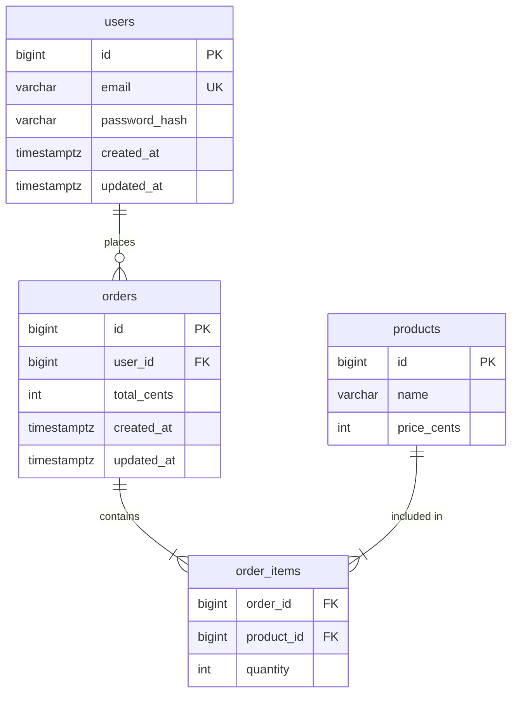

# Schema Examples

Complete annotated example output for an e-commerce schema.

---

## Entities & Attributes

| Entity | Attribute | Type | Constraints | Notes |
|--------|-----------|------|-------------|-------|
| users | id | BIGINT | PK | auto-increment |
| users | email | VARCHAR(255) | UNIQUE NOT NULL | PII |
| users | password_hash | VARCHAR(255) | NOT NULL | sensitive — never store plaintext |
| orders | id | BIGINT | PK | |
| orders | user_id | BIGINT | FK → users.id NOT NULL | |
| orders | total_cents | INT | NOT NULL CHECK > 0 | store as cents, avoid float |

## Relationships

| From | Cardinality | To | Via |
|------|-------------|-----|-----|
| users | 1 : N | orders | orders.user_id |
| orders | N : M | products | order_items |

## ER Diagram



## DDL SQL (PostgreSQL)

```sql
CREATE TABLE users (
    id          BIGSERIAL PRIMARY KEY,
    email       VARCHAR(255) NOT NULL UNIQUE,
    password_hash VARCHAR(255) NOT NULL,
    created_at  TIMESTAMPTZ NOT NULL DEFAULT NOW(),
    updated_at  TIMESTAMPTZ NOT NULL DEFAULT NOW()
);

CREATE TABLE products (
    id          BIGSERIAL PRIMARY KEY,
    name        VARCHAR(255) NOT NULL,
    price_cents INT NOT NULL CHECK (price_cents > 0),
    created_at  TIMESTAMPTZ NOT NULL DEFAULT NOW(),
    updated_at  TIMESTAMPTZ NOT NULL DEFAULT NOW()
);

CREATE TABLE orders (
    id          BIGSERIAL PRIMARY KEY,
    user_id     BIGINT NOT NULL REFERENCES users(id) ON DELETE RESTRICT,
    total_cents INT NOT NULL CHECK (total_cents > 0),
    created_at  TIMESTAMPTZ NOT NULL DEFAULT NOW(),
    updated_at  TIMESTAMPTZ NOT NULL DEFAULT NOW()
);

CREATE TABLE order_items (
    order_id    BIGINT NOT NULL REFERENCES orders(id) ON DELETE CASCADE,
    product_id  BIGINT NOT NULL REFERENCES products(id) ON DELETE RESTRICT,
    quantity    INT NOT NULL CHECK (quantity > 0),
    PRIMARY KEY (order_id, product_id)
);
```

## Migration File: 20260316120000_create_initial_schema.sql

```sql
-- up
CREATE TABLE users ( ... );
CREATE TABLE products ( ... );
CREATE TABLE orders ( ... );
CREATE TABLE order_items ( ... );

-- down
DROP TABLE IF EXISTS order_items;
DROP TABLE IF EXISTS orders;
DROP TABLE IF EXISTS products;
DROP TABLE IF EXISTS users;
```

## Index Recommendations

| Index | Table | Columns | Reason |
|-------|-------|---------|--------|
| idx_orders_user_id | orders | user_id | FK lookup — "all orders for a user" |
| idx_order_items_product_id | order_items | product_id | FK lookup — "all orders containing a product" |
| idx_users_email | users | email | Already covered by UNIQUE constraint |

## Design Decisions

- **Prices stored as cents (INT)**: avoids floating point rounding errors in financial calculations
- **ON DELETE RESTRICT on orders.user_id**: prevent accidental user deletion that would orphan order history; use soft delete on users instead
- **ON DELETE CASCADE on order_items.order_id**: an order and its line items are one unit; deleting the order removes items automatically
- **No enum for order status**: use a `order_statuses` lookup table to allow adding new statuses without a schema migration
