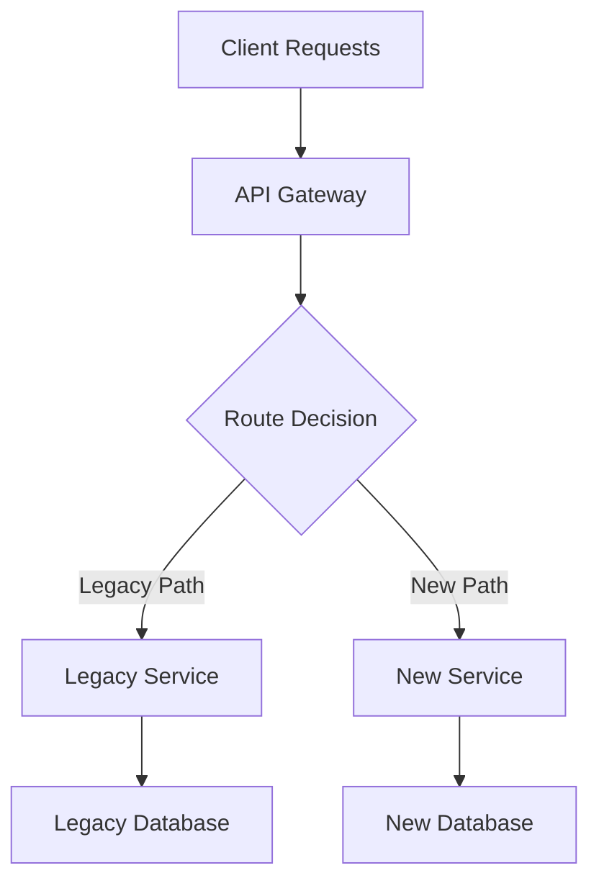

# Migration Patterns and Reference

Detailed patterns, runbooks, templates, and best practices for system migrations.

---

## Core Capabilities

- **Cross-system migration planning** — phased plans with clear validation gates
- **Risk assessment** — identify failure modes and mitigation strategies before execution
- **Timeline estimation** — generate realistic timelines based on migration complexity
- **Stakeholder communication** — templates and progress dashboards

### Compatibility Analysis
- Schema evolution: analyze database schema changes for backward compatibility
- API versioning: detect breaking changes in REST/GraphQL APIs and microservice interfaces
- Data type validation: identify data format mismatches and conversion requirements
- Constraint analysis: validate referential integrity and business rule changes

### Rollback Strategy Generation
- Automated rollback plans for each migration phase
- Data recovery scripts: point-in-time data restoration
- Service rollback: service version rollbacks with traffic management
- Validation checkpoints: success criteria and rollback triggers

---

## Migration Patterns

### Database Migrations

#### Schema Evolution Patterns

1. **Expand-Contract Pattern**
   - **Expand:** Add new columns/tables alongside existing schema
   - **Dual Write:** Application writes to both old and new schema
   - **Migration:** Backfill historical data to new schema
   - **Contract:** Remove old columns/tables after validation

2. **Parallel Schema Pattern**
   - Run new schema in parallel with existing schema
   - Use feature flags to route traffic between schemas
   - Validate data consistency between parallel systems
   - Cutover when confidence is high

3. **Event Sourcing Migration**
   - Capture all changes as events during migration window
   - Apply events to new schema for consistency
   - Enable replay capability for rollback scenarios

#### Data Migration Strategies

1. **Bulk Data Migration**
   - Snapshot Approach: Full data copy during maintenance window
   - Incremental Sync: Continuous data synchronization with change tracking
   - Stream Processing: Real-time data transformation pipelines

2. **Dual-Write Pattern**
   - Write to both source and target systems during migration
   - Implement compensation patterns for write failures
   - Use distributed transactions where consistency is critical

3. **Change Data Capture (CDC)**
   - Stream database changes to target system
   - Maintain eventual consistency during migration
   - Enable zero-downtime migrations for large datasets

### Service Migrations

#### Strangler Fig Pattern

1. **Intercept Requests:** Route traffic through proxy/gateway
2. **Gradually Replace:** Implement new service functionality incrementally
3. **Legacy Retirement:** Remove old service components as new ones prove stable
4. **Monitoring:** Track performance and error rates throughout transition



#### Parallel Run Pattern

1. **Dual Execution:** Run both old and new services simultaneously
2. **Shadow Traffic:** Route production traffic to both systems
3. **Result Comparison:** Compare outputs to validate correctness
4. **Gradual Cutover:** Shift traffic percentage based on confidence

#### Canary Deployment Pattern

1. **Limited Rollout:** Deploy new service to small percentage of users
2. **Monitoring:** Track key metrics (latency, errors, business KPIs)
3. **Gradual Increase:** Increase traffic percentage as confidence grows
4. **Full Rollout:** Complete migration once validation passes

### Infrastructure Migrations

#### Cloud-to-Cloud Migration

1. **Assessment Phase** — inventory resources, map to target cloud equivalents, identify vendor-specific features requiring refactoring
2. **Pilot Migration** — migrate non-critical workloads first, validate performance and cost models
3. **Production Migration** — use IaC for consistency, implement cross-cloud networking, maintain DR capabilities

#### On-Premises to Cloud Migration

1. **Lift and Shift** — minimal changes, quick migration with optimization later
2. **Re-architecture** — redesign for cloud-native patterns (microservices, containers, serverless)
3. **Hybrid Approach** — keep sensitive data on-premises, migrate compute to cloud

---

## Feature Flags for Migrations

### Progressive Feature Rollout

```python
class MigrationFeatureFlag:
    def __init__(self, flag_name, rollout_percentage=0):
        self.flag_name = flag_name
        self.rollout_percentage = rollout_percentage

    def is_enabled_for_user(self, user_id):
        hash_value = hash(f"{self.flag_name}:{user_id}")
        return (hash_value % 100) < self.rollout_percentage

    def gradual_rollout(self, target_percentage, step_size=10):
        while self.rollout_percentage < target_percentage:
            self.rollout_percentage = min(
                self.rollout_percentage + step_size,
                target_percentage
            )
            yield self.rollout_percentage
```

### Circuit Breaker Pattern

Implement automatic fallback to legacy systems when new systems show degraded performance:

```python
class MigrationCircuitBreaker:
    def __init__(self, failure_threshold=5, timeout=60):
        self.failure_count = 0
        self.failure_threshold = failure_threshold
        self.timeout = timeout
        self.last_failure_time = None
        self.state = 'CLOSED'  # CLOSED, OPEN, HALF_OPEN

    def call_new_service(self, request):
        if self.state == 'OPEN':
            if self.should_attempt_reset():
                self.state = 'HALF_OPEN'
            else:
                return self.fallback_to_legacy(request)

        try:
            response = self.new_service.process(request)
            self.on_success()
            return response
        except Exception as e:
            self.on_failure()
            return self.fallback_to_legacy(request)
```

---

## Data Validation and Reconciliation

### Validation Strategies

1. **Row Count Validation** — compare record counts between source and target; account for soft deletes and filtered records
2. **Checksums and Hashing** — generate checksums for critical data subsets; compare hash values to detect data drift
3. **Business Logic Validation** — run critical business queries on both systems; compare aggregate results

### Reconciliation Patterns

1. **Delta Detection**
   ```sql
   -- Example delta query for reconciliation
   SELECT 'missing_in_target' as issue_type, source_id
   FROM source_table s
   WHERE NOT EXISTS (
       SELECT 1 FROM target_table t
       WHERE t.id = s.id
   )
   UNION ALL
   SELECT 'extra_in_target' as issue_type, target_id
   FROM target_table t
   WHERE NOT EXISTS (
       SELECT 1 FROM source_table s
       WHERE s.id = t.id
   );
   ```

2. **Automated Correction** — implement data repair scripts for common issues; use idempotent operations; log all correction actions

---

## Rollback Strategies

### Database Rollback

1. **Schema Rollback** — maintain schema version control; keep rollback scripts for each migration step
2. **Data Rollback** — point-in-time recovery using database backups; transaction log replay

### Service Rollback

1. **Blue-Green Deployment** — keep previous version running; switch traffic back if issues arise
2. **Rolling Rollback** — gradually shift traffic back; monitor health during rollback

### Infrastructure Rollback

1. **Infrastructure as Code** — version control all infrastructure definitions; maintain rollback templates
2. **Data Persistence** — preserve data in original location; implement data sync back to original

---

## Risk Assessment Framework

### Risk Categories

1. **Technical Risks** — data loss or corruption, service downtime, integration failures, scalability issues
2. **Business Risks** — revenue impact, customer experience degradation, compliance concerns, brand reputation
3. **Operational Risks** — team knowledge gaps, insufficient testing, inadequate monitoring, communication breakdowns

### Risk Mitigation Strategies

1. **Technical** — comprehensive testing, gradual rollout, data validation, performance monitoring
2. **Business** — stakeholder communication plans, business continuity procedures, customer notification
3. **Operational** — team training, runbook creation, on-call rotation, post-migration retrospectives

---

## Migration Runbooks

### Pre-Migration Checklist

- [ ] Migration plan reviewed and approved
- [ ] Rollback procedures tested and validated
- [ ] Monitoring and alerting configured
- [ ] Team roles and responsibilities defined
- [ ] Stakeholder communication plan activated
- [ ] Backup and recovery procedures verified
- [ ] Test environment validation complete
- [ ] Performance benchmarks established
- [ ] Security review completed
- [ ] Compliance requirements verified

### During Migration

- [ ] Execute migration phases in planned order
- [ ] Monitor key performance indicators continuously
- [ ] Validate data consistency at each checkpoint
- [ ] Communicate progress to stakeholders
- [ ] Document any deviations from plan
- [ ] Execute rollback if success criteria not met
- [ ] Coordinate with dependent teams
- [ ] Maintain detailed execution logs

### Post-Migration

- [ ] Validate all success criteria met
- [ ] Perform comprehensive system health checks
- [ ] Execute data reconciliation procedures
- [ ] Monitor system performance over 72 hours
- [ ] Update documentation and runbooks
- [ ] Decommission legacy systems (if applicable)
- [ ] Conduct post-migration retrospective
- [ ] Archive migration artifacts
- [ ] Update disaster recovery procedures

---

## Communication Templates

### Executive Summary Template

```
Migration Status: [IN_PROGRESS | COMPLETED | ROLLED_BACK]
Start Time: [YYYY-MM-DD HH:MM UTC]
Current Phase: [X of Y]
Overall Progress: [X%]

Key Metrics:
- System Availability: [X.XX%]
- Data Migration Progress: [X.XX%]
- Performance Impact: [+/-X%]
- Issues Encountered: [X]

Next Steps:
1. [Action item 1]
2. [Action item 2]

Risk Assessment: [LOW | MEDIUM | HIGH]
Rollback Status: [AVAILABLE | NOT_AVAILABLE]
```

### Technical Team Update Template

```
Phase: [Phase Name] - [Status]
Duration: [Started] - [Expected End]

Completed Tasks:
✓ [Task 1]
✓ [Task 2]

In Progress:
🔄 [Task 3] - [X% complete]

Upcoming:
⏳ [Task 4] - [Expected start time]

Issues:
⚠️ [Issue description] - [Severity] - [ETA resolution]

Metrics:
- Migration Rate: [X records/minute]
- Error Rate: [X.XX%]
- System Load: [CPU/Memory/Disk]
```

---

## Success Metrics

### Technical Metrics

- **Migration Completion Rate:** Percentage of data/services successfully migrated
- **Downtime Duration:** Total system unavailability during migration
- **Data Consistency Score:** Percentage of data validation checks passing
- **Performance Delta:** Performance change compared to baseline
- **Error Rate:** Percentage of failed operations during migration

### Business Metrics

- **Customer Impact Score:** Measure of customer experience degradation
- **Revenue Protection:** Percentage of revenue maintained during migration
- **Time to Value:** Duration from migration start to business value realization
- **Stakeholder Satisfaction:** Post-migration stakeholder feedback scores

---

## Best Practices

### Planning Phase

1. **Start with Risk Assessment:** Identify all potential failure modes before planning
2. **Design for Rollback:** Every migration step should have a tested rollback procedure
3. **Validate in Staging:** Execute full migration process in production-like environment
4. **Plan for Gradual Rollout:** Use feature flags and traffic routing for controlled migration

### Execution Phase

1. **Monitor Continuously:** Track both technical and business metrics throughout
2. **Communicate Proactively:** Keep all stakeholders informed of progress and issues
3. **Document Everything:** Maintain detailed logs for post-migration analysis
4. **Stay Flexible:** Be prepared to adjust timeline based on real-world performance

### Validation Phase

1. **Automate Validation:** Use automated tools for data consistency and performance checks
2. **Business Logic Testing:** Validate critical business processes end-to-end
3. **Load Testing:** Verify system performance under expected production load
4. **Security Validation:** Ensure security controls function properly in new environment

---

## CI/CD Integration

```yaml
# Example migration pipeline stage
migration_validation:
  stage: test
  script:
    - python scripts/compatibility_checker.py --before=old_schema.json --after=new_schema.json
    - python scripts/migration_planner.py --config=migration_config.json --validate
  artifacts:
    reports:
      - compatibility_report.json
      - migration_plan.json
```

## Infrastructure as Code Example

```terraform
# Example Terraform for blue-green infrastructure
resource "aws_instance" "blue_environment" {
  count = var.migration_phase == "preparation" ? var.instance_count : 0
  # Blue environment configuration
}

resource "aws_instance" "green_environment" {
  count = var.migration_phase == "execution" ? var.instance_count : 0
  # Green environment configuration
}
```
